# Xéétali — Diagrammes UML (rétro-ingénierie)

> **Méthode.** Tous les diagrammes de ce document ont été **rétro-conçus par lecture exhaustive du code source réel** — `backend/app/models/`, `backend/app/schemas/`, `backend/app/services/`, `backend/app/routers/`, `backend/app/core/`, `docker-compose.yml`, `backend/Dockerfile` — et non déduits d'une spécification externe. Chaque diagramme est suivi d'une note qui explicite ce qui, dans le code, le justifie. Les diagrammes sont écrits en syntaxe [Mermaid](https://mermaid.js.org/) : ils se rendent nativement sur GitHub, GitLab, VS Code (extension Mermaid) et la plupart des visualiseurs Markdown modernes.
>
> Périmètre couvert : le backend FastAPI (`backend/app/`) dans son intégralité — 13 entités persistées, 12 routeurs, 11 services, 10 énumérations métier. Le frontend est représenté au niveau composant/architecture (§7) mais pas décomposé classe par classe : c'est une application React fonctionnelle (hooks), pas un modèle objet.

---

## Sommaire

1. [Diagramme de classes — modèle de domaine complet](#1-diagramme-de-classes--modèle-de-domaine-complet)
2. [Diagramme entité-association (ERD) — schéma physique](#2-diagramme-entité-association-erd--schéma-physique)
3. [Diagramme de cas d'utilisation](#3-diagramme-de-cas-dutilisation)
4. [Diagrammes de séquence — flux critiques](#4-diagrammes-de-séquence--flux-critiques)
5. [Diagramme d'états — cycle de vie de la poche de sang](#5-diagramme-détats--cycle-de-vie-de-la-poche-de-sang)
6. [Diagramme de paquetages — architecture en couches](#6-diagramme-de-paquetages--architecture-en-couches)
7. [Diagramme de composants / déploiement — infrastructure Docker](#7-diagramme-de-composants--déploiement--infrastructure-docker)
8. [Diagramme d'activité — UC-04 transfert inter-hôpitaux](#8-diagramme-dactivité--uc-04-transfert-inter-hôpitaux)
9. [Matrice de compatibilité ABO/Rh (référence)](#9-matrice-de-compatibilité-aborh-référence)

---

## 1. Diagramme de classes — modèle de domaine complet

Source : les 13 fichiers de `backend/app/models/*.py` et les 10 énumérations de `backend/app/schemas/enums.py`. Toutes les entités héritent de `Base` (SQLAlchemy 2.0 `DeclarativeBase`, `backend/app/db/base.py`) et utilisent exclusivement la syntaxe `Mapped[...]`/`mapped_column`.

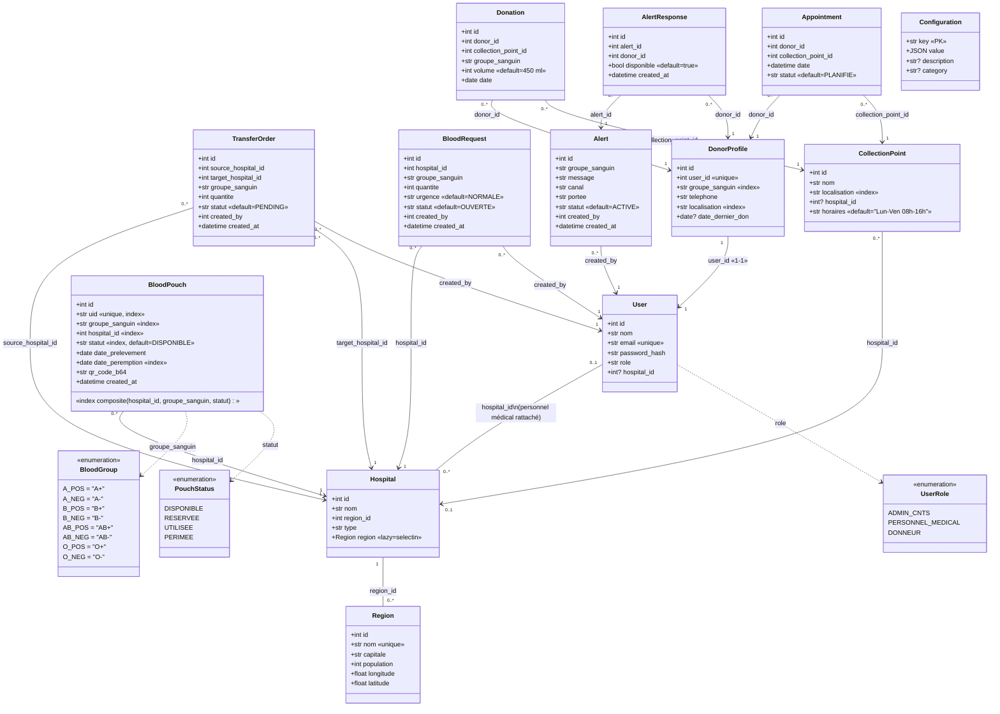

**Constats de rétro-ingénierie notables**

- **`BloodPouch` n'a aucune colonne de quantité et aucune relation `relationship()`** — c'est délibéré et central au domaine : le stock d'un hôpital pour un groupe = `COUNT(*)` en direct sur `blood_pouches WHERE hospital_id=… AND groupe_sanguin=… AND statut='DISPONIBLE'`. Aucune ligne du schéma ne dénormalise cette information.
- **`Configuration` est la seule entité sans clé étrangère** — table clé/valeur générique (`key` en `String(100)` PRIMARY KEY, `value` en `JSON`), utilisée pour les seuils de stock et de gamification.
- **Aucune des 12 clés étrangères du schéma ne déclare `ondelete=`** — comportement par défaut du SGBD (NO ACTION) appliqué implicitement partout, non documenté dans le code.
- **`TransferOrder` ne référence aucune `BloodPouch`** — le lien entre un ordre de transfert et les poches physiques qu'il a effectivement déplacées n'existe dans aucune table ; seul l'agrégat `(source, cible, groupe, quantité)` est persisté.
- Les énumérations `AppointmentStatus`, `AlertStatus`, `AlertChannel`, `AlertScope`, `RequestStatus`, `TransferStatus`, `Urgence` existent également dans `schemas/enums.py` (7 de plus, omises ci-dessus pour lisibilité — voir §2 pour leurs valeurs).

---

## 2. Diagramme entité-association (ERD) — schéma physique

Vue base de données, avec cardinalités et clés — complète le diagramme de classes avec la perspective SQL/Postgres réelle (types, contraintes `NOT NULL`, index).

```mermaid
erDiagram
    REGIONS ||--o{ HOSPITALS : "region_id"
    HOSPITALS ||--o{ USERS : "hospital_id (nullable)"
    HOSPITALS ||--o{ BLOOD_POUCHES : "hospital_id"
    HOSPITALS ||--o{ TRANSFER_ORDERS : "source_hospital_id"
    HOSPITALS ||--o{ TRANSFER_ORDERS : "target_hospital_id"
    HOSPITALS ||--o{ BLOOD_REQUESTS : "hospital_id"
    HOSPITALS ||--o{ COLLECTION_POINTS : "hospital_id (nullable)"
    USERS ||--o{ TRANSFER_ORDERS : "created_by"
    USERS ||--o{ BLOOD_REQUESTS : "created_by"
    USERS ||--o{ ALERTS : "created_by"
    USERS ||--|| DONOR_PROFILES : "user_id (1-1, unique)"
    DONOR_PROFILES ||--o{ DONATIONS : "donor_id"
    DONOR_PROFILES ||--o{ APPOINTMENTS : "donor_id"
    DONOR_PROFILES ||--o{ ALERT_RESPONSES : "donor_id"
    COLLECTION_POINTS ||--o{ DONATIONS : "collection_point_id"
    COLLECTION_POINTS ||--o{ APPOINTMENTS : "collection_point_id"
    ALERTS ||--o{ ALERT_RESPONSES : "alert_id"

    REGIONS {
        int id PK
        string nom UK "14 régions du Sénégal"
        string capitale
        int population
        float longitude
        float latitude
    }
    HOSPITALS {
        int id PK
        string nom
        int region_id FK
        string type "Hôpital / CHR / Centre National"
    }
    USERS {
        int id PK
        string nom
        string email UK
        string password_hash "bcrypt"
        string role "ADMIN_CNTS / PERSONNEL_MEDICAL / DONNEUR"
        int hospital_id FK "nullable"
    }
    BLOOD_POUCHES {
        int id PK
        string uid UK "XEE-XXXXXXXXXXXX"
        string groupe_sanguin
        int hospital_id FK
        string statut "DISPONIBLE/RESERVEE/UTILISEE/PERIMEE"
        date date_prelevement
        date date_peremption
        text qr_code_b64 "data URI PNG base64"
        datetime created_at
    }
    TRANSFER_ORDERS {
        int id PK
        int source_hospital_id FK
        int target_hospital_id FK
        string groupe_sanguin
        int quantite
        string statut "PENDING/COMPLETED/REJECTED"
        int created_by FK
        datetime created_at
    }
    BLOOD_REQUESTS {
        int id PK
        int hospital_id FK
        string groupe_sanguin
        int quantite
        string urgence "NORMALE/URGENTE/CRITIQUE"
        string statut "OUVERTE/SATISFAITE/ANNULEE"
        int created_by FK
        datetime created_at
    }
    DONOR_PROFILES {
        int id PK
        int user_id FK UK
        string groupe_sanguin
        string telephone
        string localisation
        date date_dernier_don "nullable"
    }
    DONATIONS {
        int id PK
        int donor_id FK
        int collection_point_id FK
        string groupe_sanguin
        int volume "ml, défaut 450"
        date date
    }
    APPOINTMENTS {
        int id PK
        int donor_id FK
        int collection_point_id FK
        datetime date
        string statut "PLANIFIE/HONORE/ANNULE"
    }
    COLLECTION_POINTS {
        int id PK
        string nom
        string localisation
        int hospital_id FK "nullable"
        string horaires
    }
    ALERTS {
        int id PK
        string groupe_sanguin
        text message
        string canal "SMS/PUSH"
        string portee "LOCALE/NATIONALE"
        string statut "ACTIVE/CLOTUREE"
        int created_by FK
        datetime created_at
    }
    ALERT_RESPONSES {
        int id PK
        int alert_id FK
        int donor_id FK
        bool disponible
        datetime created_at
    }
    CONFIGURATIONS {
        string key PK
        json value
        string description "nullable"
        string category "nullable"
    }
```

**Notes de rétro-ingénierie**

- `CONFIGURATIONS` apparaît isolée dans l'ERD : aucune FK entrante ni sortante — table de paramétrage pur, consommée par clé (`stock.ideal`, `stock.low_threshold`, `gamification.level_{1..5}_threshold`).
- `USERS.hospital_id` est nullable : seul le personnel médical (`PERSONNEL_MEDICAL`) l'utilise réellement ; un `ADMIN_CNTS` ou un `DONNEUR` l'a toujours à `NULL`.
- `DONOR_PROFILES.user_id` porte une contrainte `unique=True` explicite (`models/donor_profile.py:18-20`) — c'est la garantie technique de la relation 1-1 User↔DonorProfile, pas une simple convention applicative.
- Deux migrations Alembic versionnées trouvées dans `backend/alembic/versions/` : `7540754927c6_schema_initial.py` (schéma de base) puis `b5dffbffc82e_region_table_and_hospital_region_fk.py` (introduction ultérieure de `REGIONS` et de la FK `HOSPITALS.region_id` — avant cette migration, la localisation d'un hôpital était probablement une chaîne libre).

---

## 3. Diagramme de cas d'utilisation

Mermaid n'a pas de notation native pour les diagrammes de cas d'utilisation UML ; la convention ci-dessous (acteurs → cas d'usage groupés en sous-graphes par sous-système, flèches d'association) est le rendu standard de repli. Source : les 12 routeurs de `backend/app/routers/` croisés avec leurs dépendances `require_role(...)`.

```mermaid
flowchart LR
    Admin["👤 Administrateur CNTS"]
    Medic["👤 Personnel médical"]
    Donor["👤 Donneur"]

    subgraph AUTH["Authentification"]
        UC1["UC-01 Se connecter"]
        UC2["UC-02 S'inscrire (donneur uniquement)"]
    end

    subgraph STOCK["Gestion du stock (UC-08)"]
        UC8["UC-08 Enregistrer une poche\n(UID + QR générés)"]
        UC9["UC-09 Changer le statut d'une poche"]
        UC10["UC-10 Rechercher des poches"]
        UC11["UC-11 Vérifier la validité d'une poche (QR)"]
        UC12["UC-12 Consulter l'inventaire par hôpital"]
    end

    subgraph TRANSFERT["Transferts & demandes (UC-04)"]
        UC4["UC-04 Transférer des poches\nentre hôpitaux"]
        UC13["UC-13 Émettre une demande de sang"]
        UC14["UC-14 Consulter les demandes"]
    end

    subgraph DONNEUR_UC["Espace donneur (UC-14 à UC-18)"]
        UC15["UC-15 Gérer son profil donneur"]
        UC16["UC-16 Consulter les points de collecte"]
        UC17["UC-17 Prendre rendez-vous"]
        UC18["UC-18 Consulter historique de dons"]
        UC19["UC-19 Consulter statistiques\n& classement (gamification)"]
    end

    subgraph ALERTE["Alertes (UC-17 CNTS)"]
        UC20["UC-20 Lancer une alerte ciblée\n/ campagne nationale"]
        UC21["UC-21 Répondre à une alerte"]
        UC22["UC-22 Consulter les alertes actives"]
    end

    subgraph ADMIN_UC["Administration"]
        UC23["UC-23 Tableau de bord & analytics"]
        UC24["UC-24 Carte nationale (stock par région)"]
        UC25["UC-25 CRUD comptes utilisateurs"]
        UC26["UC-26 CRUD établissements"]
        UC27["UC-27 Configurer les seuils système"]
    end

    Admin --> UC1
    Medic --> UC1
    Donor --> UC1
    Donor --> UC2

    Medic --> UC8
    Medic --> UC9
    Admin --> UC9
    Medic --> UC10
    Donor --> UC10
    Admin --> UC10
    Medic --> UC11
    Donor --> UC11
    Admin --> UC11
    Medic --> UC12
    Admin --> UC12
    Donor --> UC12

    Admin --> UC4
    Medic --> UC13
    Admin --> UC13
    Medic --> UC14
    Admin --> UC14
    Donor --> UC14

    Donor --> UC15
    Donor --> UC16
    Donor --> UC17
    Donor --> UC18
    Donor --> UC19

    Admin --> UC20
    Donor --> UC21
    Donor --> UC22
    Medic --> UC22
    Admin --> UC22

    Admin --> UC23
    Admin --> UC24
    Admin --> UC25
    Admin --> UC26
    Admin --> UC27
```

**Cas d'utilisation par rôle — vérifié par `require_role(...)` dans le code, pas déduit**

| Rôle | Cas d'utilisation exclusifs (autre rôle → 403) |
|---|---|
| `ADMIN_CNTS` | UC-04 (transfert), UC-20 (campagne), UC-23 à UC-27 (tout `/api/admin/*`, gardé au niveau routeur) |
| `PERSONNEL_MEDICAL` | UC-08, UC-09 (partagé avec Admin), UC-13 (partagé avec Admin) |
| `DONNEUR` | UC-02, UC-15 à UC-19, UC-21 (partagé avec aucun autre rôle) |
| Partagés (tout rôle authentifié) | UC-10, UC-11, UC-12, UC-14, UC-22 |

---

## 4. Diagrammes de séquence — flux critiques

### 4.1 Connexion (login)

Source : `routers/auth.py:23-27`, `services/auth_service.py:49-54`, `core/security.py`, `core/deps.py`.

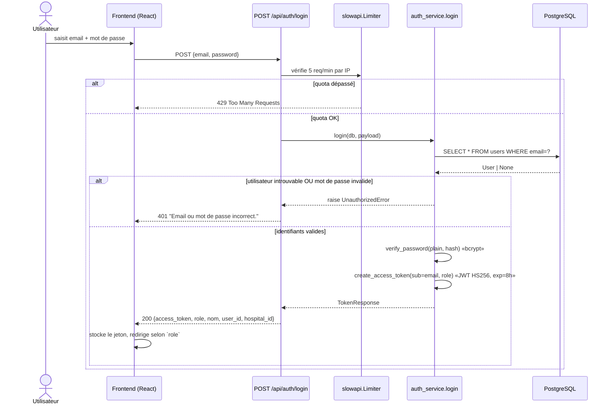

### 4.2 UC-08 — Enregistrement d'une poche de sang

Source : `routers/pouches.py:20-25`, `services/pouch_service.py:42-64`.

```mermaid
sequenceDiagram
    actor M as Personnel médical
    participant API as POST /api/pouches
    participant RBAC as require_role(MEDICAL, ADMIN)
    participant SVC as pouch_service.register_pouch
    participant QR as qrcode (lib)
    participant DB as PostgreSQL

    M->>API: {groupe_sanguin, hospital_id, date_prelevement, date_peremption}
    API->>RBAC: vérifie le rôle courant
    RBAC-->>API: 403 si rôle insuffisant
    API->>API: validation Pydantic «date_peremption > date_prelevement»
    API->>SVC: register_pouch(db, payload)
    SVC->>DB: SELECT hospital WHERE id=? (existence)
    alt hôpital introuvable
        SVC-->>API: raise HospitalNotFoundError
        API-->>M: 404
    else hôpital existe
        SVC->>SVC: uid = "XEE-" + uuid4().hex[:12].upper()
        SVC->>QR: qrcode.make(uid) → PNG → base64
        QR-->>SVC: data:image/png;base64,...
        SVC->>DB: INSERT INTO blood_pouches (statut=DISPONIBLE, ...)
        SVC->>DB: COMMIT
        DB-->>SVC: poche persistée (id, created_at)
        SVC-->>API: BloodPouch
        API-->>M: 201 PouchRead {uid, qr_code_b64, statut: "DISPONIBLE", ...}
    end
    Note over SVC,DB: Le stock nde l'hôpital est désormais +1 pour ce\ngroupe — automatiquement, aucune colonne à resynchroniser.
```

### 4.3 UC-04 — Transfert inter-hôpitaux

Source : `routers/transfers.py`, `services/transfer_service.py:33-86`. Le flux le plus rigoureux du dépôt en matière de concurrence (`SELECT … FOR UPDATE SKIP LOCKED`).

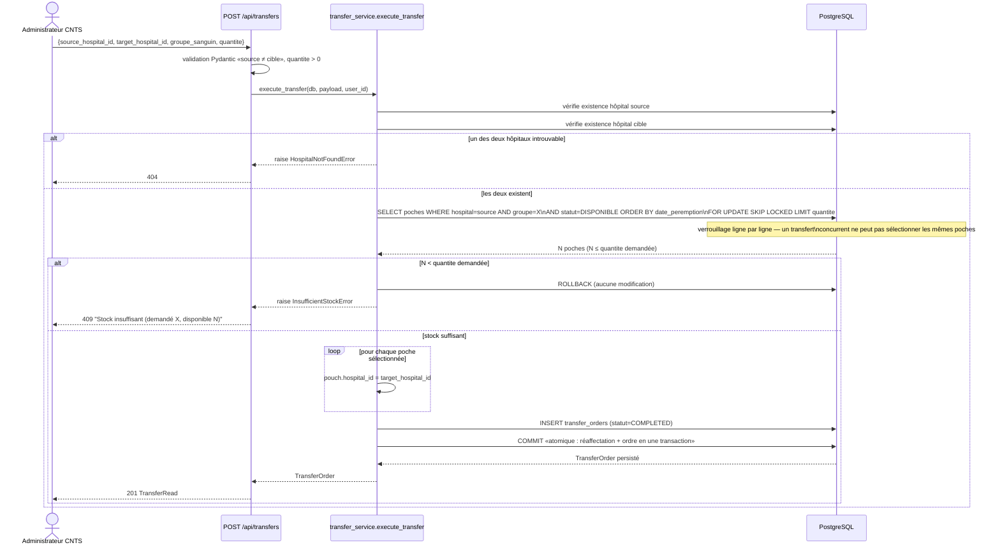

### 4.4 UC-17 (CNTS) — Campagne d'alerte donneurs

Source : `routers/admin.py:92-99`, `services/alert_service.py:37-91`, `core/constants.py` (matrice ABO/Rh).

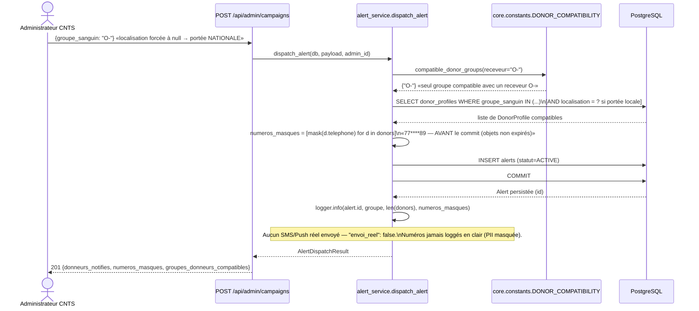

### 4.5 UC-16 — Prise de rendez-vous (donneur)

Source : `routers/appointments.py`, `services/appointment_service.py:15-32`.

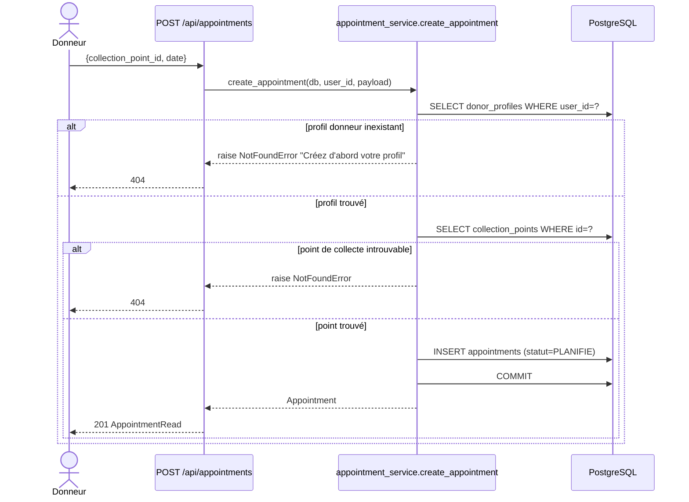

---

## 5. Diagramme d'états — cycle de vie de la poche de sang

Source : `schemas/enums.py::PouchStatus`, `services/pouch_service.py::update_status`, `routers/pouches.py::PATCH /api/pouches/{uid}/status`.

### 5.1 Comportement réel du code (aucune garde de transition)

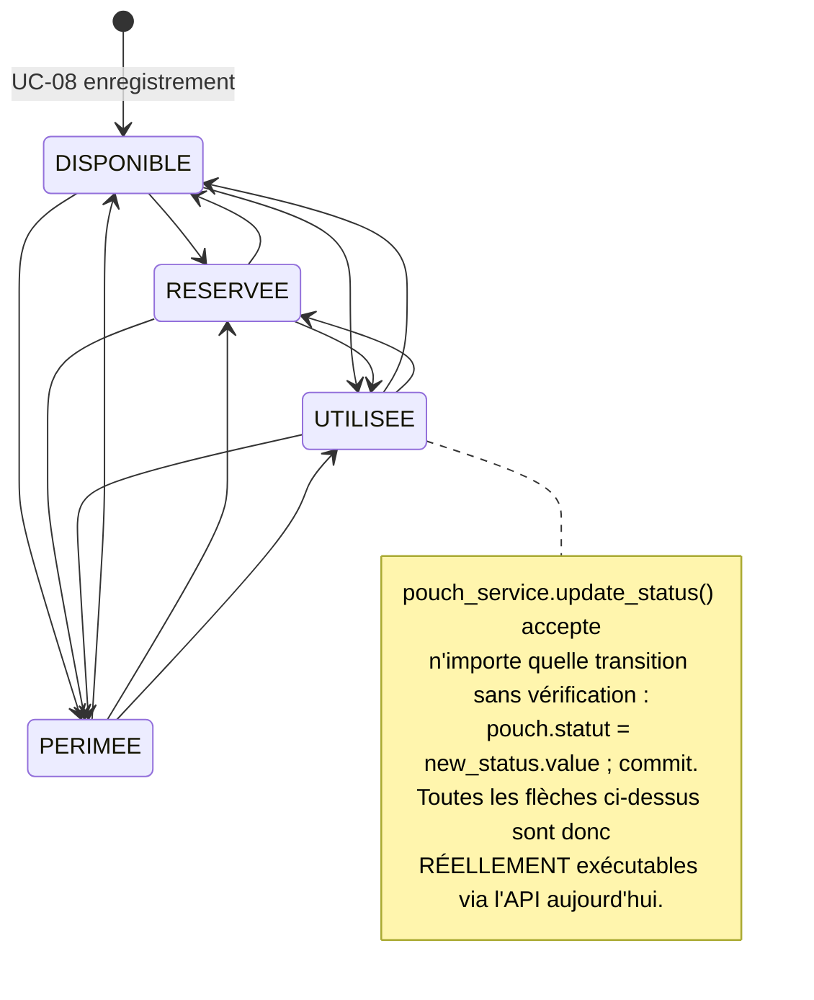

### 5.2 Machine à états recommandée (non implémentée — voir audit)

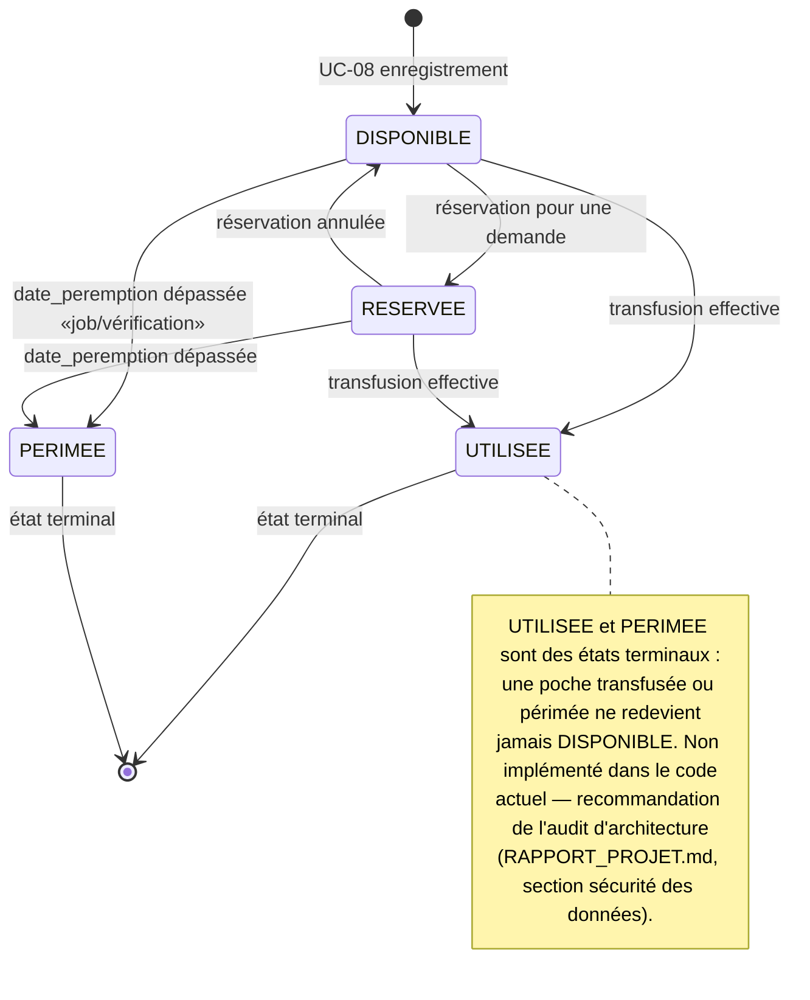

---

## 6. Diagramme de paquetages — architecture en couches

Source : structure réelle de `backend/app/`.

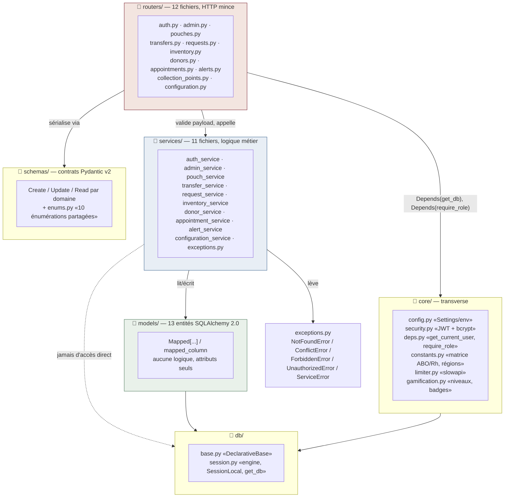

**Règle observée sans exception** : aucun routeur ne contient de requête SQL ni de règle métier ; aucun service n'importe `fastapi.HTTPException` (traduction HTTP centralisée uniquement dans `main.py`, cf. `RAPPORT_PROJET.md`).

---

## 7. Diagramme de composants / déploiement — infrastructure Docker

Source : `docker-compose.yml`, `backend/Dockerfile`, `frontend/Dockerfile`.

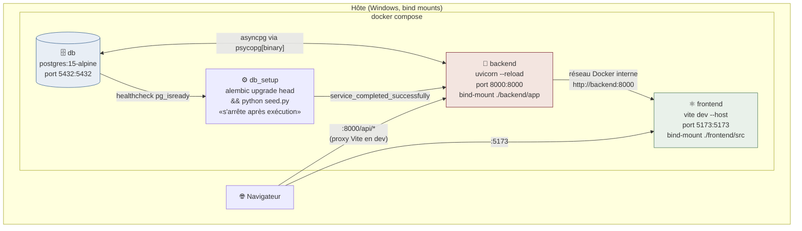

**Constats de rétro-ingénierie**

- `db_setup` est un conteneur **à exécution unique** (pas de `restart`) — il applique les migrations Alembic puis peuple la base si elle est vide (`seed.py` idempotent, garde `Hospital.count() > 0`), puis se termine ; `backend` ne démarre qu'une fois `db_setup` terminé avec succès (`depends_on: condition: service_completed_successfully`).
- `backend` et `frontend` montent le code source en bind-mount avec rechargement à chaud (`uvicorn --reload`, `vite` + `CHOKIDAR_USEPOLLING=true`) — environnement de développement, pas une image de production figée (le `Dockerfile` frontend a un stage `builder` distinct d'un stage Nginx final, non utilisé par ce compose).
- Le volume `postgres_data` est déclaré `external: true` — il survit à `docker compose down -v`, suppression manuelle requise pour repartir d'une base vide.

---

## 8. Diagramme d'activité — UC-04 transfert inter-hôpitaux

Vue algorithmique du même flux que §4.3, sous forme d'activité (montre les branchements et le point d'atomicité).

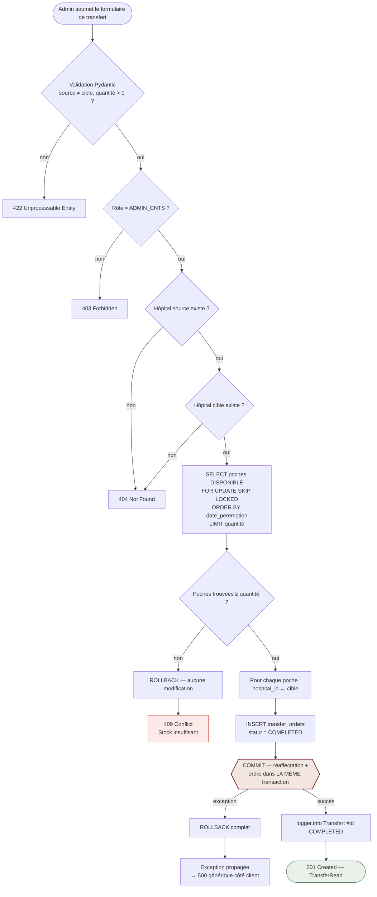

---

## 9. Matrice de compatibilité ABO/Rh (référence)

Source : `core/constants.py::DONOR_COMPATIBILITY`, la seule source de vérité de ce calcul dans tout le dépôt (utilisée par `alert_service._select_target_donors`).

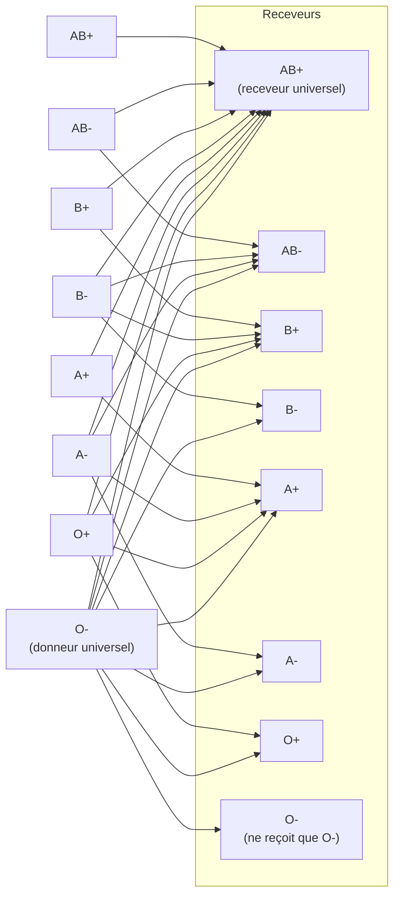

*Lecture : une flèche `X → Y` signifie « un donneur de groupe X peut donner à un receveur de groupe Y » (règle érythrocytaire standard : Rh- ne reçoit que Rh-, Rh+ reçoit Rh- et Rh+ ; O donneur universel, AB+ receveur universel).*

---

*Document généré par rétro-ingénierie du code source au commit courant de la branche `maimouna`. Toute évolution du modèle de données ou des flux applicatifs doit être répercutée ici pour que ce document reste fiable — il ne se régénère pas automatiquement.*
